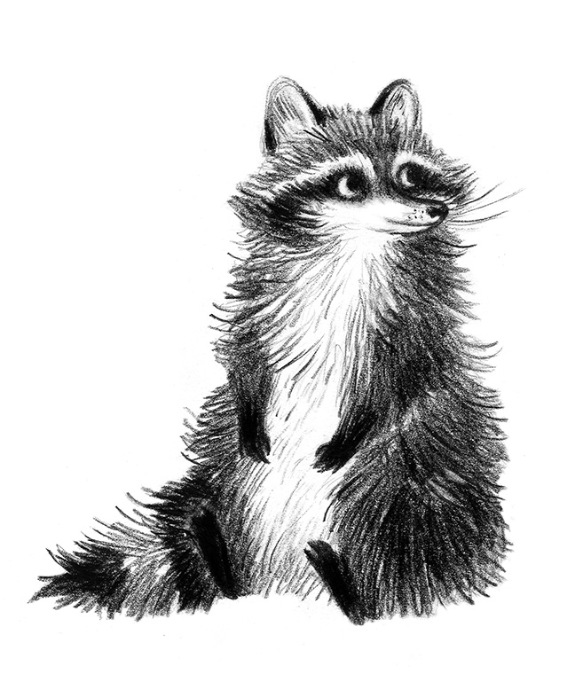

# wit

**An initial commit message generator as a git hook.**



The “initial commit” message as a first commit in many repos is quite boring (personally speaking
of course). Since that initial commit message conveys very little valuable information to begin
with, developers should have a chance to have some fun with that first message. Thinking of a
clever message can be hard however, so that’s where **wit** comes in.

With a collection of funny, clever, and witty messages (brought to you
by the many contributors of [ngerakines/commitment](https://github.com/ngerakines/commitment)),
**wit** automatically fills out your first commit message in any newly-created git repository.

Witty Waccoon mascot by Lauren Pettapiece, https://www.laurenpettapiece.com/

## Getting Started

### Prerequisites

> Note: wit works best on Linux and macOS.

* `curl` or `wget` should be installed
* `git` should be installed

### Installation

Wit is installed by running one of the following commands in your terminal. You can install this via
the command-line with either `curl` or `wget`.

**via curl**

```sh
sh -c "$(curl -fsSL https://raw.githubusercontent.com/cedricium/wit/master/scripts/install.sh)"
```

**via wget**

```sh
sh -c "$(wget https://raw.githubusercontent.com/cedricium/wit/master/scripts/install.sh -O -)"
```


## Using wit

### Adding / Removing Commit Messages

The list of commit messages used by wit can be found at: `$HOME/.wit/res/commit_messages.txt`
Feel free to add or remove any lines you see fit, ensuring there are no empty lines in the file.

### Uninstalling wit

*Coming soon.*


## Contributing

Your contributions are always welcome! See an issue you want to tackle or have an idea for a feature
you'd like implemented? Just open a pull-request with a short explanation of the changes and I'd be 
happy to review it.

Refer to this project's [contributing guidelines](CONTRIBUTING.md) to better understand what's
expected as a contributing member.


## License

Wit released under the [MIT License](LICENSE.md).
